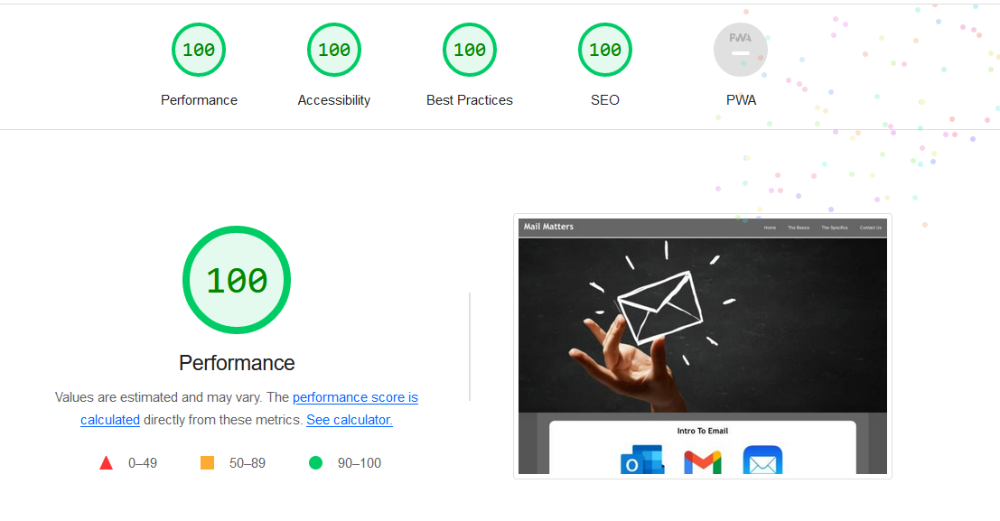

## Live Link
[https://fergalcob.github.io/Mail-Matters/](https://fergalcob.github.io/Mail-Matters/)

## Table of Contents
- [Styling Choices](#styling-choices)
   * [Color Palette](#color-palette)
   * [Font Usage](#font-usage)
- [Device Testing Results & Known Issues](#device-testing-results--known-issues)
   * [Devices & Browsers Used For Testing](#devices--browsers-used-for-testing)
   * [W3C Validator & Lighthouse Testing](#w3c-validator--lighthouse-testing)
   * [Currently Known Issues](#currently-known-issues)
- [Deployment](#deployment)
  * [Github Pages](#github-pages)
- [Technologies Used](#technologies-used)
- [Credits](#credits)
 
## Styling Choices

### Color Palette

The primary choices shift from light to dark grays as these would be commonly used when designing HTML based email. In order to provide structure to non-full width emails, the dark to light shift helps focus the reader towards the content and the color choices here aim to replicate that design with the darker grays giving way to lighter colours where the content is found.

The red and blue shades are used in the specifics.html page to outline the information relative to their respective email clients, #DB4437 being the red used by Google in Gmail and #00A2ED being Microsoft Outlook blue.

### Font Usage

Similar to the color palette choices, the font choices are a number of fonts commonly used in HTML emails, as email clients may not respect the styling necessary to import a font-family via URL and also in some cases, users may not be able to guarantee that their audience would have a local copy of a font available, the use of web-safe fonts is a necessity. For this site, I've used two of those web-safe fonts, Verdana and Trebuchet MS due to their reach across operating systems.

## Device Testing Results & Known Issues

### Devices & Browsers Used For Testing

1. Laptop(Acer Nitro 5)
    * Chrome
    * Edge
    * Firefox

2. Android Phone(Realme 9 Pro & Samsung S21)
    * Chrome
    * Firefox

3. Android Tablet(Lenovo Tab)
    * Chrome

### W3C Validator & Lighthouse Testing

  
index.html results - Validator and Lighthouse

  
  #### W3C Validator Results
  
  
  #### Lighthouse Results - Desktop
  
  
  #### Lighthouse Results - Mobile
  

  
basics.html results - Validator and Lighthouse

  
  #### W3C Validator Results
  
  
  #### Lighthouse Results - Desktop
  
  
  #### Lighthouse Results - Mobile
  

  
specifics.html results - Validator and Lighthouse

  
  #### W3C Validator Results
  
  
  #### Lighthouse Results - Desktop
  
  
  #### Lighthouse Results - Mobile
  
  

  
contact.html results - Validator and Lighthouse

  
  #### W3C Validator Results
  
  
  #### Lighthouse Results - Desktop
  
  
  #### Lighthouse Results - Mobile
  
  

  
thankyou.html results - Validator and Lighthouse

  
  #### W3C Validator Results
  
  
  #### Lighthouse Results - Desktop
  
  
  #### Lighthouse Results - Mobile
  

  
404.html results - Validator and Lighthouse

  
  #### W3C Validator Results
  
  
  #### Lighthouse Results - Desktop
  
  
  #### Lighthouse Results - Mobile
  
  

### Jigsaw Validation Of CSS

### Currently Known Issues

1. When using Firefox on Android mobile devices, on the Contact page, when scrolling with the dynamic address bar enabled and is positioned at the bottom of the screen, when the address bar is hidden due to the scroll, there is empty space left where the address bar would be until the scrolling reaches the footer. This has been reported as a bug previously [here](https://github.com/mozilla-mobile/fenix/issues/8768) however the workarounds suggested there did not resolve this instance of the issue.

## Deployment

### Github Pages

1. To deploy the live site, from the Github directory for the project, access the Settings page(indicated by the cog icon) from the navbar.
2. Once in the Settings page, access the Pages subsection from the menu on the left under 'Code and Automation'.
3. From here, you want to choose the source for the site, in this case 'Deploy from branch' is used as the source, followed by choosing the branch, in this case it's 'Main' and '/root'
4. All that needs to be done from there is to save those settings and allow 5-10 minutes for deployment to complete.
5. At that point, the page was then live at [https://fergalcob.github.io/Mail-Matters/](https://fergalcob.github.io/Mail-Matters/)

## Technologies Used
* [HTML5](https://en.wikipedia.org/wiki/HTML5)
   - Used to build the underlying structure of the website and to add the content for users
* [CSS](https://en.wikipedia.org/wiki/CSS)
   - Used to provide the styling necessary to set the final layout of the site and to implement responsiveness across device types
* [GIMP](https://www.gimp.org/) 
   - Used for scaling the banner images for responsiveness
* [Am I Responsive](https://ui.dev/amiresponsive) 
   - For testing and creating the Readme banner image
* [Coolors](https://coolors.co)
  - Used to create the color palette shown in the Readme
* [RealFaviconGenerator](https://realfavicongenerator.net/)
  - Used for generating the favicon set and code from the personally  created icon

## Credits
* The dropdown menu is adapted from the Checkbox Hack guide from [CSS-Tricks](https://css-tricks.com/the-checkbox-hack/)
* Banner images courtesy of [123rf.com](https://www.123rf.com/)
* Logos for email clients from their respective creators(Google, Apple, Microsoft)
* Footer Social Media Icons from [Font Awesome](https://fontawesome.com/)
* [Mozilla Developer Network](https://developer.mozilla.org/en-US/) and [W3CSchools](https://www.w3schools.com/) for their guides on flex and grid layouts

