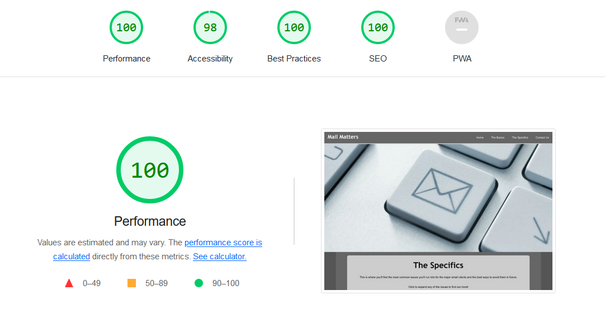
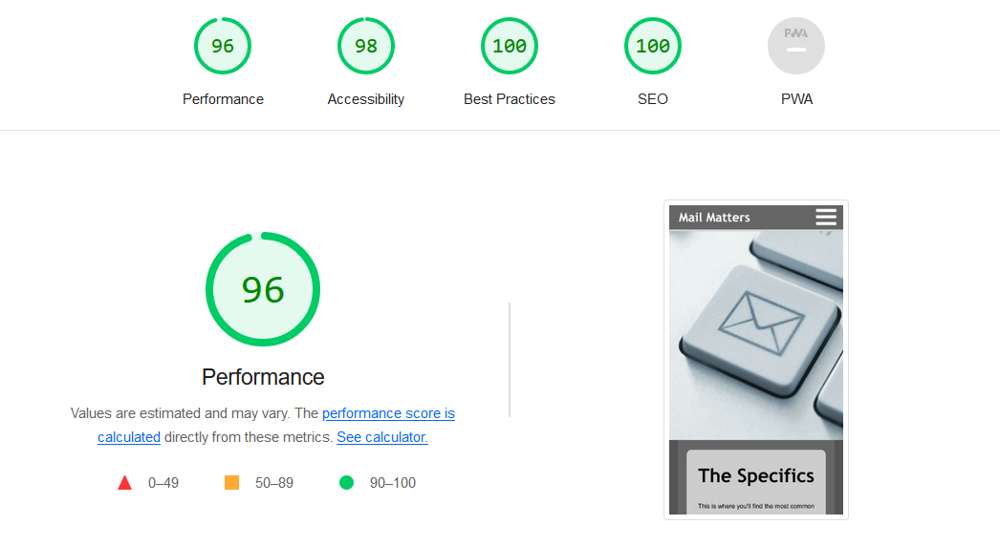

# Device Testing Results & Known Issues

## Devices & Browsers Used For Testing

1. Laptop(Acer Nitro 5)
    * Chrome
    * Edge
    * Firefox

2. Android Phone(Realme 9 Pro & Samsung S21)
    * Chrome
    * Firefox

3. Android Tablet(Lenovo Tab)
    * Chrome

## W3C Validator & Lighthouse Testing

  
index.html results - Validator and Lighthouse

  
  #### W3C Validator Results
  
  
  #### Lighthouse Results - Desktop
  
  
  #### Lighthouse Results - Mobile
  

  
basics.html results - Validator and Lighthouse

  
  #### W3C Validator Results
  
  
  #### Lighthouse Results - Desktop
  
  
  #### Lighthouse Results - Mobile
  

  
specifics.html results - Validator and Lighthouse

  
  #### W3C Validator Results
  
  
  #### Lighthouse Results - Desktop
  
  
  #### Lighthouse Results - Mobile
  
  

  
contact.html results - Validator and Lighthouse

  
  #### W3C Validator Results
  
  
  #### Lighthouse Results - Desktop
  
  
  #### Lighthouse Results - Mobile
  
  

  
thankyou.html results - Validator and Lighthouse

  
  #### W3C Validator Results
  
  
  #### Lighthouse Results - Desktop
  
  
  #### Lighthouse Results - Mobile
  

  
404.html results - Validator and Lighthouse

  
  #### W3C Validator Results
  
  
  #### Lighthouse Results - Desktop
  
  
  #### Lighthouse Results - Mobile
  
  

## Jigsaw Validation Of CSS

## Currently Known Issues

1. When using Firefox on Android mobile devices, on the Contact page, when scrolling with the dynamic address bar enabled and is positioned at the bottom of the screen, when the address bar is hidden due to the scroll, there is empty space left where the address bar would be until the scrolling reaches the footer. This has been reported as a bug previously [here](https://github.com/mozilla-mobile/fenix/issues/8768) however the workarounds suggested there did not resolve this instance of the issue.

