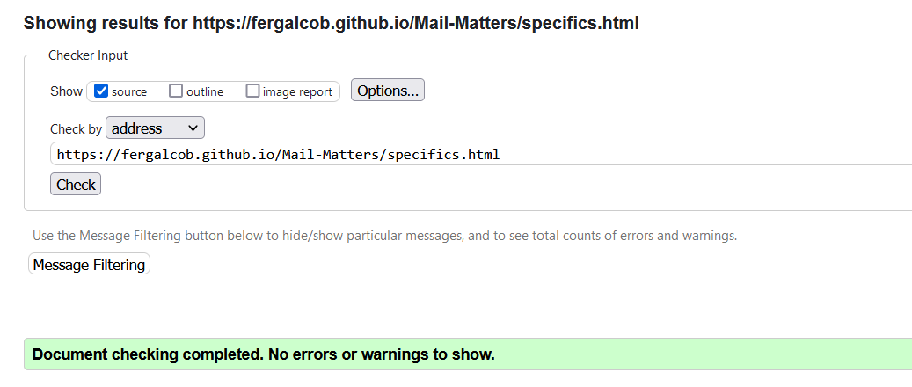

## Live Link
[https://fergalcob.github.io/Mail-Matters/](https://fergalcob.github.io/Mail-Matters/)

## Table of Contents
 - [Site Inspiration](#site-inspiration)
 - [User Stories](#user-stories)
   * [First Time User](#first-time-user)
 - [Features](#features)
   * [Common Features](#common-features)
     1. [Navbar](#navbar)
     2. [Footer](#footer)
   * [Index.html Features](#index.html-features)
     1. [Banner Image](#banner-image)
     2. [Site Aims](#site-aims)
   * [Basics.html Features](#basics.html-features)
     1. [Page Layout](#page-layout)
   * [Specifics.html Features](#specifics.html-features)
     1. [Client Specific Information](#client-specific-information)
   * [Contact.html Features](#contact.html-features)
     1. [Contact Form](#contact-form)
   * [Future Plans](#future-plans)
- [Styling Choices](#styling-choices)
   * [Color Palette](#color-palette)
   * [Typography](#typography)
   * [Favicon](#favicon)
- [Device Testing Results & Known Issues](#device-testing-results--known-issues)
   * [Devices & Browsers Used For Testing](#devices--browsers-used-for-testing)
   * [W3C Validator & Lighthouse Testing](#w3c-validator--lighthouse-testing)
   * [Currently Known Issues](#currently-known-issues)
   * [Solved Issues](#solved-issues)
- [Deployment](#deployment)
  * [Github Pages](#github-pages)
- [Technologies Used](#technologies-used)
- [Credits](#credits)
 
 
## Site Inspiration

The inspiration for this site came from my current career supporting people in the Communications industry with HTML email design. Users often encounter a number of common issues when viewing these emails through certain clients however there isn't really a suitable database of what these issues can be and as such finding solutions can be a case of searching through multiple websites. The idea here was to create a centralised location for users to learn about the concepts underlying the technologies in use and also to be able to find the issues they're currently dealing with and to be provided the solutions all in one place.

## User Stories

### First Time User

 1. As a first time user, I want to be able to easily navigate the site from any page
 2. As a first time user, I want to clearly understand the target audience of the site and its intended purpose within a short timeframe
 3. As a first time user, I want the site to be useable on any device and for it to be comfortable and responsive to use on smaller devices
 4. As a first time user, I want to know where I can go to get further information on a specific topic or to reach out about the site itself
 5. As a first time user, I would like to have some general information available if I'm not looking for a specific issue

### Returning User

 1. As a returning user, I would like to be able to easily find information on specific topics relating to my specific issue
 2. As a returning user, I would like to have a way to get in contact to request topics be covered in future
 3. As a returning user, I would like to know about new topics that have been covered since my last visit to the site either via newsletter, social media channels or via the site itself

## Features 

### Common Features

#### Navbar

The navbar is found across all pages on the site, giving easy access to all pages with its fixed positioning allowing the page links to be accessible at all times regardless of where the user has scrolled to within the currently open page. Within the navbar, we also have the site name which also acts as a clickable link to return the user to the home page at any time. The page links also include a hover functionality when used on laptop/desktops to indicate the currently highlighted link.

| Laptop/Desktop Banner |
| --- |
|  |

When accessed via mobile, this navbar switches to a dropdown menu to allow for all content to be accessible at any time without taking over the screen space of the page itself. The menu itself is accessed through the hamburger icon which creates for non-obtrusive access to allow for the logo to be retained at the same sizing.

| Mobile Navbar Closed | Mobile Navbar Open |
| --- | --- |
|  |  |

#### Footer

The footer uses a grid-design across all pages to link to the relevant social media pages for the site, with each icon being instantly recognizable to the user and in future the placeholder links could allow for the user to follow the site for updates through the relevant links.

| Laptop/Desktop Footer |
| --- |
|  |

| Mobile Footer |
| --- |
|  |

### Index.html features

#### Banner Image

The banner image uses a responsive image-set to react to the device being used to access the site, such as mobile device for mobiles, a tablet for tablets etc. as you can see in the images below. This is both to represent how the site is being accessed at the time, but also to visualize how people interact with emails in these current times and that all types of devices would be important to support in terms of responsiveness.

| Laptop/Desktop Banner |
| --- |
|  |

| Mobile Banner | Tablet Banner |
| --- | --- |
|  |  |

#### Site Aims

The Site Aims sections utilises a 3-column layout on laptop/desktop while switching to a 1-column on mobile devices allowing for easy readability on any device, these Aims are separated by a vertical divider in the 3-column layout switching to a horizontal in the 1-column view. The intent of this section as one of the initial items a first-time user of the site will see is to give users a very brief overview of the goals of the site itself with each goal corresponding to one of the sub-pages of the site.

| 3-Column Laptop/Desktop Layout Of Site Aims |
| --- |
| 

| Single Column Mobile Layout Of Site Aims |
| --- |
|  |

### Basics.html Features

#### Page Layout

The aim of the Basics page is to give a new user a clear indication of the target audience for the site, both for new and returning users, the clear imagery of the email client icons being easily recognizable and with the code snippets within the "HTML and Email" being targeted towards users who would interact with both HTML and email on a regular basis.

With this page, the content of the page simply shifts with the device being used, retaining a single column layout across mobile and larger devices, with the font-sizing changing appropriately across devices.

| Laptop/Desktop Layout Of Intro To Email |
| --- |
|  |

| Mobile Layout Of Intro To Email |
| --- |
|  |

### Specifics.html Features

#### Client Specific Information

So the Specifics page is intended to be a repository of the issues that users can run into on a day to day basis. As such this is intended to grow over time as more issues and solutions are added. Because of this, the information is added within a clickable &lt;Details&gt; tag which allows users to expand the information that they want while the rest remains hidden. Having the full information be hidden allows the page to grow while not overloading the user with unnecessary information. When switching to a mobile device, this becomes a single-column layout for the information to be clearly readable without overly shrinking the two-column layout.
 
In addition to this, the content of each section is color-coded to the client the information is intended for, with the Google red for the Gmail issues and the Outlook blue for the Outlook issues.

| Laptop/Desktop Layout Of Client Information |
| --- |
|  |

| Mobile Layout Of Client Information Closed | Mobile Layout Of Client Information Open |
| --- | --- |
|  |  |

### Contact.html Features

#### Contact Form

With the contact page, we begin with a two-column layout on larger devices, with the information on what are the benefits to the user of signing up or leaving a comment on the site being displayed on the left hand-side of the page, with the right-side being used for the form itself. With the current implementation, this form allows users to both leave a comment and also has an opt-in checkbox for users to consider receiving a newsletter in future if they so choose. Currently, this form only leads to a generic Thank You page if the required details(First Name, Last Name, Email Address) are submitted but this could be updated in future to handle these details and add them to a database for further use such as signing-in.

| Laptop/Desktop Layout Of Contact Form |
| --- |
|  |

| Mobile Layout Of Contact Form |
| --- |
|  |

### Future Plans

* To implement a search feature, as more content would be added to the Specifics page, allowing users to perform a search per section to cut down on time spent looking for the information they need.
* Implementing proper handling of the Contact Page form so that users can submit their details and have it sent to a database to record any comments left or newsletter sign-ups rather than the placeholder Thank You page currently in place

## Styling Choices

### Color Palette

The primary choices shift from light to dark grays as these would be commonly used when designing HTML based email. In order to provide structure to non-full width emails, the dark to light shift helps focus the reader towards the content and the color choices here aim to replicate that design with the darker grays giving way to lighter colours where the content is found.

The red and blue shades are used in the specifics.html page to outline the information relative to their respective email clients, #DB4437 being the red used by Google in Gmail and #00A2ED being Microsoft Outlook blue.

### Typography

Similar to the color palette choices, the font choices are a number of fonts commonly used in HTML emails, as email clients may not respect the styling necessary to import a font-family via URL and also in some cases, users may not be able to guarantee that their audience would have a local copy of a font available, the use of web-safe fonts is a necessity. For this site, I've used two of those web-safe fonts, Verdana and Trebuchet MS due to their reach across operating systems.

### Favicon

The favicon was created specifically for the site itself, with the imagery of the two Ms, one overlaid upon the other representing the site name "Mail Matters" while also being evocative of an envelope to bring it together with the email focused nature of the site itself.

## Device Testing Results & Known Issues

### Devices & Browsers Used For Testing

1. Laptop(Acer Nitro 5 & Lenovo Ideapad 5)
    * Chrome
    * Edge
    * Firefox

2. Android Phone(Realme 9 Pro & Samsung S21)
    * Chrome
    * Firefox

3. Android Tablet(Lenovo Tab)
    * Chrome

### W3C Validator & Lighthouse Testing

  
index.html results - Validator and Lighthouse

  
  #### W3C Validator Results
  
  
  #### Lighthouse Results - Desktop
  
  
  #### Lighthouse Results - Mobile
  

  
basics.html results - Validator and Lighthouse

  
  #### W3C Validator Results
  
  
  #### Lighthouse Results - Desktop
  
  
  #### Lighthouse Results - Mobile
  

  
specifics.html results - Validator and Lighthouse

  
  #### W3C Validator Results
  
  
  #### Lighthouse Results - Desktop
  
  
  #### Lighthouse Results - Mobile
  
  

  
contact.html results - Validator and Lighthouse

  
  #### W3C Validator Results
  
  
  #### Lighthouse Results - Desktop
  
  
  #### Lighthouse Results - Mobile
  
  

  
thankyou.html results - Validator and Lighthouse

  
  #### W3C Validator Results
  
  
  #### Lighthouse Results - Desktop
  
  
  #### Lighthouse Results - Mobile
  

  
404.html results - Validator and Lighthouse

  
  #### W3C Validator Results
  
  
  #### Lighthouse Results - Desktop
  
  
  #### Lighthouse Results - Mobile
  
  

### Jigsaw Validation Of CSS

### Currently Known Issues

1. When using Firefox on Android mobile devices, on the Contact page, when scrolling with the dynamic address bar enabled and is positioned at the bottom of the screen, when the address bar is hidden due to the scroll, there is empty space left where the address bar would be until the scrolling reaches the footer. This has been reported as a bug previously [here](https://github.com/mozilla-mobile/fenix/issues/8768) however the workarounds suggested there did not resolve this instance of the issue.

### Solved Issues

1. The banner images on the Index, Basics & Specifics pages were reported to introduce a horizontal scrollbar on browsers with a non-autohiding vertical scrollbar due to the 100vw width that was initially in place for those banner images.
 - Issue resolved by switching to 100% width rather than viewport width
2. On some devices, the code snippet on the Basics page was escaping the div it was contained in causing the page to scroll to the right.
 - Added "word-break: break-word;" to the styling for this section in addition to the pre-existing "white-space: pre-line;" to support a wider range of devices

## Deployment

### Github Pages

1. To deploy the live site, from the Github directory for the project, access the Settings page(indicated by the cog icon) from the navbar.
2. Once in the Settings page, access the Pages subsection from the menu on the left under 'Code and Automation'.
3. From here, you want to choose the source for the site, in this case 'Deploy from branch' is used as the source, followed by choosing the branch, in this case it's 'Main' and '/root'
4. All that needs to be done from there is to save those settings and allow 5-10 minutes for deployment to complete.
5. At that point, the page was then live at [https://fergalcob.github.io/Mail-Matters/](https://fergalcob.github.io/Mail-Matters/)

## Technologies Used
* [HTML5](https://en.wikipedia.org/wiki/HTML5)
   - Used to build the underlying structure of the website and to add the content for users
* [CSS](https://en.wikipedia.org/wiki/CSS)
   - Used to provide the styling necessary to set the final layout of the site and to implement responsiveness across device types
* [GIMP](https://www.gimp.org/) 
   - Used for scaling the banner images for responsiveness
* [Am I Responsive](https://ui.dev/amiresponsive) 
   - For testing and creating the Readme banner image
* [Coolors](https://coolors.co)
  - Used to create the color palette shown in the Readme
* [RealFaviconGenerator](https://realfavicongenerator.net/)
  - Used for generating the favicon set and code from the personally  created icon

## Credits
* The dropdown menu is adapted from the Checkbox Hack guide from [CSS-Tricks](https://css-tricks.com/the-checkbox-hack/)
* Banner images courtesy of [123rf.com](https://www.123rf.com/)
* Logos for email clients from their respective creators(Google, Apple, Microsoft)
* Footer Social Media Icons from [Font Awesome](https://fontawesome.com/)
* [Mozilla Developer Network](https://developer.mozilla.org/en-US/) and [W3CSchools](https://www.w3schools.com/) for their guides on flex and grid layouts

