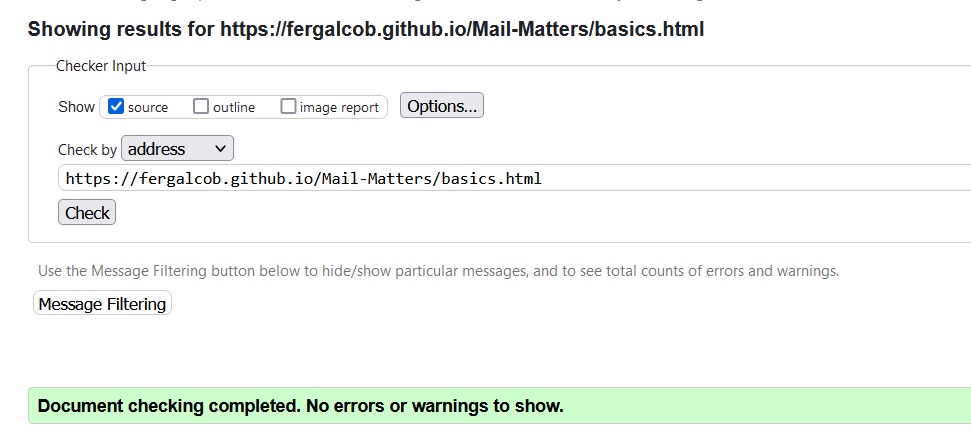
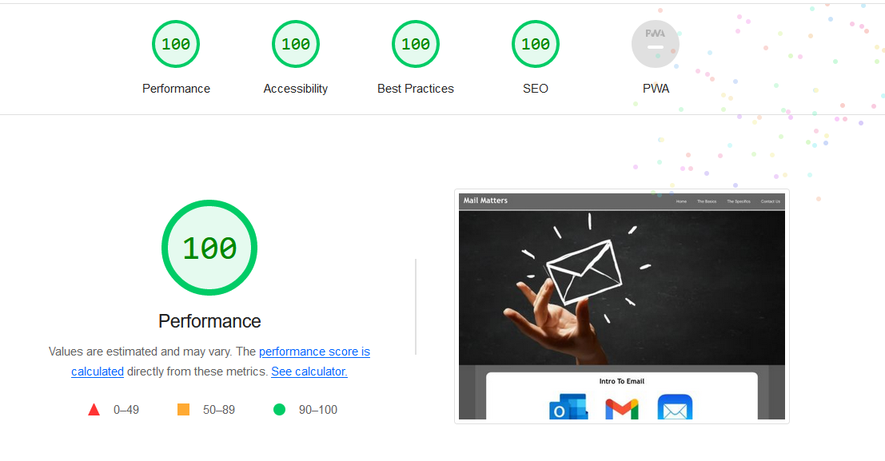
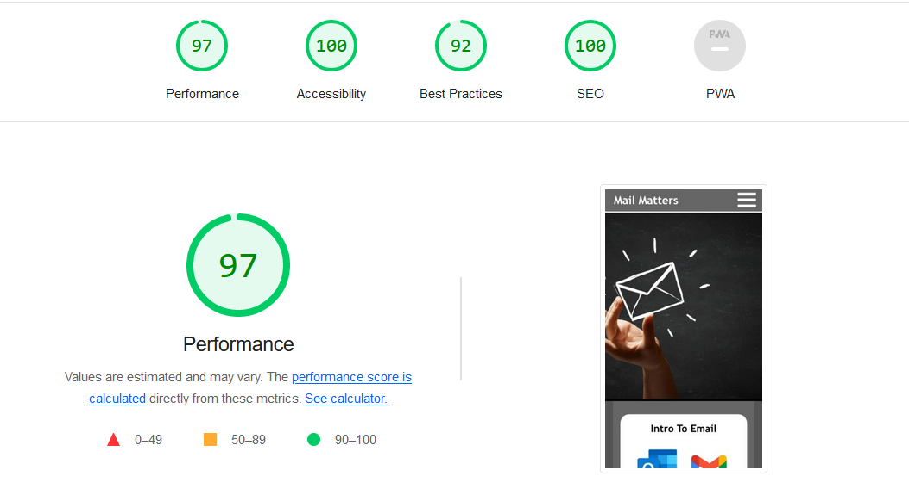
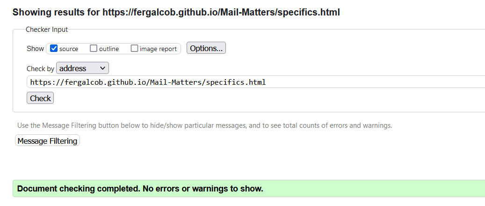
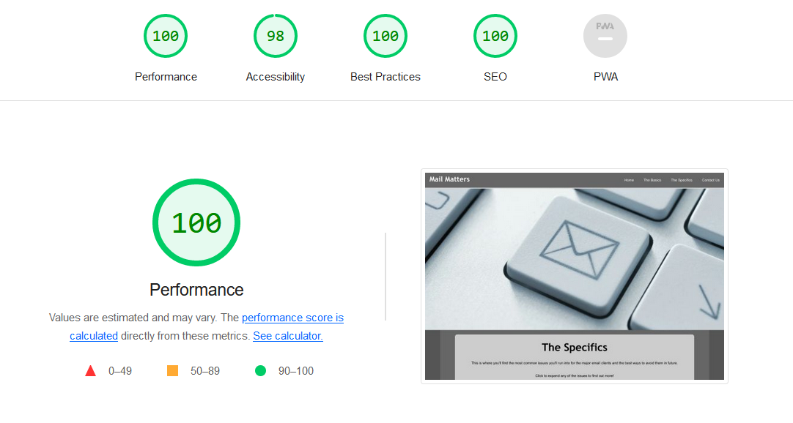
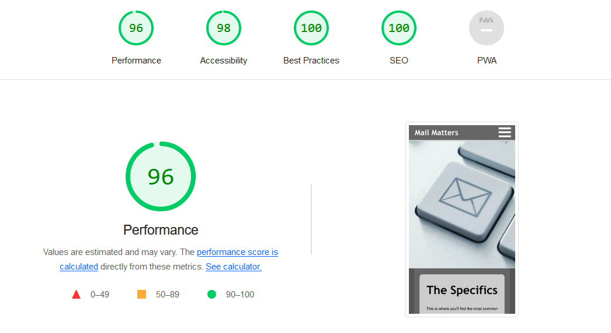

## W3C Validator & Lighthouse Testing

  
index.html results - Validator and Lighthouse

  
basics.html results - Validator and Lighthouse

  
  #### W3C Validator Results
  
  
  #### Lighthouse Results - Desktop
  
  
  #### Lighthouse Results - Mobile
  

  
specifics.html results - Validator and Lighthouse

  
  #### W3C Validator Results
  
  
  #### Lighthouse Results - Desktop
  
  
  #### Lighthouse Results - Mobile
  
  

  
contact.html results - Validator and Lighthouse

  
thankyou.html results - Validator and Lighthouse

  
error.html results - Validator and Lighthouse

